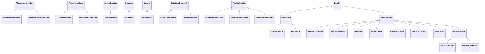

# EL BARRILETE — Refactorización a Programación Orientada a Objetos

Este documento acompaña la versión 2.0 del proyecto. Se transformó el código de funciones sueltas y variables globales en **48 clases** organizadas por responsabilidad, aplicando herencia, encapsulamiento, clases abstractas, polimorfismo e inyección de dependencias, siguiendo los principios **SOLID** y organizando las funcionalidades según el criterio **INVEST**.

Los archivos HTML, CSS, JSON e imágenes se conservaron sin cambios (salvo una corrección de una ruta de imagen, ver sección 7). Todas las clases CSS, ids y claves de `localStorage` siguen siendo las mismas, así que los carritos, usuarios y sesiones guardados con la versión anterior siguen funcionando.

---

## 1. Estructura de carpetas

```
0_Proyecto/
├── main.js                         ← Solo arranca la aplicación
├── package.json                    ← Habilita "npm test"
├── DOCUMENTACION.md
├── index*.html, css/, img/, json/, favicon/   (sin cambios)
├── tests/
│   └── logica.test.js              ← 11 pruebas automáticas
└── js/
    ├── config/Configuracion.js     ← Claves, rutas y parámetros centralizados
    ├── app/                        ← Arranque y raíz de composición
    ├── core/                       ← Infraestructura (almacenamiento, datos, eventos)
    ├── modelos/                    ← Entidades del negocio
    ├── servicios/                  ← Lógica de negocio (carrito, sesión, usuarios)
    ├── busqueda/                   ← Algoritmos de búsqueda (patrón Estrategia)
    ├── validacion/                 ← Reglas del formulario de registro
    ├── ui/
    │   ├── base/                   ← Clases abstractas de interfaz
    │   ├── componentes/            ← Partes de la página (menú, slider, carrito...)
    │   ├── elementos/              ← Piezas que se fabrican (tarjeta, fila)
    │   └── formularios/            ← Login y registro
    ├── buscadorUtils.js  ┐
    ├── carrito.js        │
    ├── carritoUI.js      ├ Archivos originales convertidos en
    ├── ui.js             │ CAPA DE COMPATIBILIDAD (ver sección 6)
    └── user.js           ┘
```

---

## 2. Jerarquías de clases (herencia)



La jerarquía más profunda tiene cuatro niveles: `BaseUI → ComponenteUI → FormularioBase → FormularioLogin`.

**Conceptos de POO aplicados**

| Concepto | Dónde se ve |
|---|---|
| Clase abstracta | `AlmacenamientoBase`, `FuenteDatosBase`, `EstrategiaBusqueda`, `ReglaValidacion`, `BaseUI`, `ComponenteUI`, `ElementoUI`, `FormularioBase`: lanzan `TypeError` si se intenta `new` directamente. |
| Encapsulamiento | Todos los atributos usan campos privados `#`. Ej.: `Usuario` no expone la contraseña (solo `verificarCredenciales`); `CarritoServicio.obtenerItems()` devuelve una copia. |
| Herencia | 26 relaciones `extends` (diagrama anterior). |
| Polimorfismo | `ItemCarrito.aJSON()` extiende `Producto.aJSON()` con `super`; cada `ComponenteUI` redefine `estaDisponible()` y `alMontar()`. |
| Métodos estáticos / fábricas | `Producto.desdeJSON`, `Sesion.anonima`, `Resultado.exito`, `Levenshtein.distancia`. |
| Getters | `producto.precio`, `item.subtotal`, `slider.diapositivaActual`. |
| Patrones de diseño | Método Plantilla (`ComponenteUI.montar`, `EstrategiaBusqueda.filtrar`), Estrategia (búsqueda), Observador (`EmisorEventos`), Repositorio, Singleton (`ContenedorDependencias`), Fábrica (`desdeJSON`). |

---

## 3. Principios SOLID aplicados

**S — Responsabilidad única.** Antes `ui.js` mezclaba slider, menú, tarjetas, formato de precios y buscador; `main.js` tenía lógica de sesión y de filtros. Ahora cada clase hace una sola cosa: `CatalogoTarjetas` dibuja, `BuscadorCatalogo` filtra, `FormateadorPrecio` formatea, `UsuarioRepositorio` guarda usuarios y `AutenticacionServicio` decide si el acceso es válido.

**O — Abierto/Cerrado.** Para agregar una validación nueva al registro se crea otra subclase de `ReglaValidacion` y se añade en `ContenedorDependencias`; `FormularioRegistro` no se toca. Igual con la búsqueda: `BusquedaExacta` ya existe como alternativa a `BusquedaSimilitud` sin modificar el buscador.

**L — Sustitución de Liskov.** `AlmacenamientoMemoria` reemplaza a `AlmacenamientoLocal` en las pruebas y todo sigue funcionando. `ItemCarrito` puede usarse donde se espera un `Producto`.

**I — Segregación de interfaces.** Las abstracciones son pequeñas: `EstrategiaBusqueda` exige solo `coincide()`, `ReglaValidacion` solo `esValido()`, `ElementoUI` solo `renderizar()`. `ComponenteUI` y `ElementoUI` están separadas porque un componente que se monta sobre el HTML no necesita `renderizar()` y una tarjeta no necesita `montar()`.

**D — Inversión de dependencias.** Ninguna clase de negocio usa `localStorage`, `fetch` ni `window.location` directamente: reciben `AlmacenamientoBase`, `FuenteDatosBase` y `Navegador` por constructor. `ContenedorDependencias` es el único lugar donde se eligen las implementaciones concretas. Gracias a esto existen pruebas automáticas que corren sin navegador.

---

## 4. Criterios INVEST por funcionalidad

INVEST es un criterio para historias de usuario. Cada funcionalidad del sistema quedó aislada en su propio grupo de clases, de modo que puede tratarse como una historia independiente:

| Historia de usuario | Clases que la implementan | I | N | V | E | S | T |
|---|---|---|---|---|---|---|---|
| HU-01 Como visitante quiero ver los productos destacados rotando en la portada | `SliderHero`, `Diapositiva` | ✔ | ✔ | ✔ | ✔ | ✔ | ✔ |
| HU-02 Como visitante quiero ir al catálogo del producto que estoy viendo | `BotonExplorar`, `FiltroServicio` | ✔ | ✔ | ✔ | ✔ | ✔ | ✔ |
| HU-03 Como cliente quiero iniciar sesión con mi usuario o correo | `FormularioLogin`, `AutenticacionServicio`, `UsuarioRepositorio` | ✔ | ✔ | ✔ | ✔ | ✔ | ✔ |
| HU-04 Como visitante quiero crear una cuenta con datos validados | `FormularioRegistro`, `Validador`, `Regla*` | ✔ | ✔ | ✔ | ✔ | ✔ | ✔ |
| HU-05 Como cliente quiero buscar licores aunque escriba con errores | `BuscadorCatalogo`, `BusquedaSimilitud`, `Levenshtein` | ✔ | ✔ | ✔ | ✔ | ✔ | ✔ |
| HU-06 Como cliente quiero agregar productos al carrito desde el catálogo | `CatalogoTarjetas`, `TarjetaProducto`, `CarritoServicio` | ✔ | ✔ | ✔ | ✔ | ✔ | ✔ |
| HU-07 Como cliente quiero cambiar cantidades y ver el total | `VistaCarrito`, `FilaCarrito`, `ItemCarrito` | ✔ | ✔ | ✔ | ✔ | ✔ | ✔ |
| HU-08 Como usuario móvil quiero un menú desplegable | `MenuHamburguesa` | ✔ | ✔ | ✔ | ✔ | ✔ | ✔ |

- **I (Independiente):** cada componente se monta solo si sus elementos existen en la página; quitar uno no rompe a los demás.
- **N (Negociable):** los parámetros (umbral de búsqueda, intervalo del slider, longitud de contraseña) están en `Configuracion.js`.
- **V (Valiosa):** cada historia entrega algo visible al usuario.
- **E (Estimable) / S (Pequeña):** ninguna clase supera las 100 líneas.
- **T (Testeable):** `tests/logica.test.js` verifica la lógica de HU-01 a HU-07 sin navegador.

---

## 5. LISTA 1 — Clases existentes

**Indispensable:** si se elimina, la aplicación deja de funcionar o pierde una funcionalidad.
**Reemplazable:** se puede eliminar o cambiar por otra implementación sin que la aplicación falle.

### 5.1 Configuración y arranque

| # | Clase | Ubicación | Qué hace | Hereda de | Clasificación |
|---|---|---|---|---|---|
| 1 | `Aplicacion` | `js/app/Aplicacion.js` | Crea y monta todos los componentes al cargar cada página. | — | Indispensable |
| 2 | `ContenedorDependencias` | `js/app/ContenedorDependencias.js` | Construye y comparte (Singleton) todos los servicios; decide qué implementación concreta se usa. | — | Indispensable |
| — | *(módulo de constantes)* `CLAVES`, `RUTAS`, `FUENTES`, `PARAMETROS` | `js/config/Configuracion.js` | Claves de `localStorage`, páginas, archivos JSON y parámetros. No es una clase. | — | Indispensable |

### 5.2 Núcleo (infraestructura)

| # | Clase | Ubicación | Qué hace | Hereda de | Clasificación |
|---|---|---|---|---|---|
| 3 | `AlmacenamientoBase` | `js/core/AlmacenamientoBase.js` | Contrato abstracto de almacenamiento; aporta `leerJSON`/`escribirJSON` seguros. | — (abstracta) | Indispensable |
| 4 | `AlmacenamientoLocal` | `js/core/AlmacenamientoLocal.js` | Guarda en `localStorage`. | `AlmacenamientoBase` | Indispensable (sustituible por otra subclase) |
| 5 | `AlmacenamientoMemoria` | `js/core/AlmacenamientoMemoria.js` | Guarda en memoria; usada en pruebas. | `AlmacenamientoBase` | Reemplazable |
| 6 | `EmisorEventos` | `js/core/EmisorEventos.js` | Patrón Observador (`suscribir` / `emitir`). | — | Indispensable |
| 7 | `Navegador` | `js/core/Navegador.js` | Encapsula `window.location.href`. | — | Indispensable |
| 8 | `FuenteDatosBase` | `js/core/FuenteDatosBase.js` | Contrato abstracto de origen de datos. | — (abstracta) | Indispensable |
| 9 | `FuenteDatosJSON` | `js/core/FuenteDatosJSON.js` | Descarga un JSON con `fetch`. | `FuenteDatosBase` | Indispensable (sustituible por otra subclase) |
| 10 | `FuenteDatosMemoria` | `js/core/FuenteDatosMemoria.js` | Datos fijos en memoria; la usan las pruebas y la capa de compatibilidad. | `FuenteDatosBase` | Reemplazable |
| 11 | `RepositorioLectura` | `js/core/RepositorioLectura.js` | Convierte datos crudos en objetos (`Producto`, `Diapositiva`) con caché. | — | Indispensable |
| 12 | `FormateadorPrecio` | `js/core/FormateadorPrecio.js` | Formatea pesos colombianos (`$59.000`). | — | Indispensable |

### 5.3 Modelos (entidades)

| # | Clase | Ubicación | Qué hace | Hereda de | Clasificación |
|---|---|---|---|---|---|
| 13 | `Producto` | `js/modelos/Producto.js` | Producto del catálogo con datos privados; unifica `titulo`/`nombre`. | — | Indispensable |
| 14 | `ItemCarrito` | `js/modelos/ItemCarrito.js` | Producto con cantidad y subtotal. | `Producto` | Indispensable |
| 15 | `Diapositiva` | `js/modelos/Diapositiva.js` | Elemento del slider; extrae la palabra clave del título. | — | Indispensable |
| 16 | `Usuario` | `js/modelos/Usuario.js` | Usuario con contraseña privada; verifica credenciales. | — | Indispensable |
| 17 | `UsuarioDemo` | `js/modelos/UsuarioDemo.js` | Usuario administrador de prueba (`Admin` / `123456`). | `Usuario` | Indispensable (permite el acceso sin registro) |
| 18 | `Sesion` | `js/modelos/Sesion.js` | Estado inmutable de la sesión. | — | Indispensable |
| 19 | `Resultado` | `js/modelos/Resultado.js` | Éxito o fallo con mensaje de una operación. | — | Indispensable |

### 5.4 Servicios (lógica de negocio)

| # | Clase | Ubicación | Qué hace | Hereda de | Clasificación |
|---|---|---|---|---|---|
| 20 | `CarritoServicio` | `js/servicios/CarritoServicio.js` | Agregar, sumar, restar, eliminar, vaciar, total; avisa cambios. | `EmisorEventos` | Indispensable |
| 21 | `SesionServicio` | `js/servicios/SesionServicio.js` | Lee, inicia y cierra la sesión. | — | Indispensable |
| 22 | `UsuarioRepositorio` | `js/servicios/UsuarioRepositorio.js` | Busca y guarda usuarios (demo + registrados). | — | Indispensable |
| 23 | `AutenticacionServicio` | `js/servicios/AutenticacionServicio.js` | Casos de uso de login, registro y salida. | — | Indispensable |
| 24 | `FiltroServicio` | `js/servicios/FiltroServicio.js` | Maneja el filtro que viaja de la portada al catálogo. | — | Indispensable |

### 5.5 Búsqueda

| # | Clase | Ubicación | Qué hace | Hereda de | Clasificación |
|---|---|---|---|---|---|
| 25 | `Levenshtein` | `js/busqueda/Levenshtein.js` | Distancia y similitud entre textos. | — | Indispensable |
| 26 | `EstrategiaBusqueda` | `js/busqueda/EstrategiaBusqueda.js` | Contrato abstracto de filtrado. | — (abstracta) | Indispensable |
| 27 | `BusquedaSimilitud` | `js/busqueda/BusquedaSimilitud.js` | Búsqueda tolerante a errores (la que se usa). | `EstrategiaBusqueda` | Indispensable (sustituible por otra estrategia) |
| 28 | `BusquedaExacta` | `js/busqueda/BusquedaExacta.js` | Búsqueda solo por coincidencia de texto. | `EstrategiaBusqueda` | Reemplazable |

### 5.6 Validación

| # | Clase | Ubicación | Qué hace | Hereda de | Clasificación |
|---|---|---|---|---|---|
| 29 | `ReglaValidacion` | `js/validacion/ReglaValidacion.js` | Contrato abstracto de una regla. | — (abstracta) | Indispensable |
| 30 | `ReglaLongitudMinima` | `js/validacion/ReglaLongitudMinima.js` | Contraseña de al menos 6 caracteres. | `ReglaValidacion` | Indispensable |
| 31 | `ReglaCamposIguales` | `js/validacion/ReglaCamposIguales.js` | Contraseña y confirmación iguales. | `ReglaValidacion` | Indispensable |
| 32 | `ReglaEmailDisponible` | `js/validacion/ReglaEmailDisponible.js` | El correo no debe existir. | `ReglaValidacion` | Indispensable |
| 33 | `Validador` | `js/validacion/Validador.js` | Aplica las reglas en orden y devuelve el primer error. | — | Indispensable |

### 5.7 Interfaz de usuario

| # | Clase | Ubicación | Qué hace | Hereda de | Clasificación |
|---|---|---|---|---|---|
| 34 | `BaseUI` | `js/ui/base/BaseUI.js` | Raíz abstracta: acceso al documento, `obtener(id)`, `crear(etiqueta)`. | — (abstracta) | Indispensable |
| 35 | `ComponenteUI` | `js/ui/base/ComponenteUI.js` | Componente que se monta sobre el HTML existente (método plantilla `montar`). | `BaseUI` (abstracta) | Indispensable |
| 36 | `ElementoUI` | `js/ui/base/ElementoUI.js` | Pieza que fabrica un nodo nuevo (`renderizar`). | `BaseUI` (abstracta) | Indispensable |
| 37 | `TarjetaProducto` | `js/ui/elementos/TarjetaProducto.js` | Dibuja una tarjeta y su botón "Agregar al carrito". | `ElementoUI` | Indispensable |
| 38 | `FilaCarrito` | `js/ui/elementos/FilaCarrito.js` | Dibuja una fila del carrito con −, +, Eliminar. | `ElementoUI` | Indispensable |
| 39 | `NavegacionSesion` | `js/ui/componentes/NavegacionSesion.js` | Muestra/oculta botones según la sesión; botón SALIR. | `ComponenteUI` | Indispensable |
| 40 | `MenuHamburguesa` | `js/ui/componentes/MenuHamburguesa.js` | Abre/cierra el menú en móviles. | `ComponenteUI` | Indispensable |
| 41 | `SliderHero` | `js/ui/componentes/SliderHero.js` | Carrusel de la portada cada 5 s. | `ComponenteUI` | Indispensable |
| 42 | `BotonExplorar` | `js/ui/componentes/BotonExplorar.js` | "Explora la colección": filtra y redirige. | `ComponenteUI` | Indispensable |
| 43 | `CatalogoTarjetas` | `js/ui/componentes/CatalogoTarjetas.js` | Carga y dibuja las tarjetas del catálogo. | `ComponenteUI` | Indispensable |
| 44 | `BuscadorCatalogo` | `js/ui/componentes/BuscadorCatalogo.js` | Caja de búsqueda y filtro guardado. | `ComponenteUI` | Indispensable |
| 45 | `VistaCarrito` | `js/ui/componentes/VistaCarrito.js` | Página del carrito; se actualiza sola al cambiar. | `ComponenteUI` | Indispensable |
| 46 | `FormularioBase` | `js/ui/formularios/FormularioBase.js` | Envío, lectura de campos, errores y redirección comunes. | `ComponenteUI` (abstracta) | Indispensable |
| 47 | `FormularioLogin` | `js/ui/formularios/FormularioLogin.js` | Formulario de inicio de sesión. | `FormularioBase` | Indispensable |
| 48 | `FormularioRegistro` | `js/ui/formularios/FormularioRegistro.js` | Formulario de creación de cuenta. | `FormularioBase` | Indispensable |

### 5.8 Otros archivos

| Archivo | Qué es | Clasificación |
|---|---|---|
| `main.js` | Punto de entrada (lo cargan todos los HTML). | Indispensable |
| `js/buscadorUtils.js`, `js/carrito.js`, `js/carritoUI.js`, `js/ui.js`, `js/user.js` | Capa de compatibilidad con los nombres antiguos. `main.js` ya no los usa. | Reemplazable (se pueden borrar) |
| `tests/logica.test.js`, `package.json` | Pruebas automáticas. | Reemplazable (no afectan la ejecución) |

**Resumen:** 48 clases → 45 indispensables y 3 reemplazables (`AlmacenamientoMemoria`, `FuenteDatosMemoria`, `BusquedaExacta`). Además, los 5 archivos de la capa de compatibilidad son reemplazables.

---

## 6. LISTA 2 — Código reutilizado con un nombre de invocación distinto

### 6.1 Funciones originales → nueva forma de invocarlas

La lógica original se reutilizó dentro de las clases; lo que cambió es cómo se llama. Los nombres antiguos siguen existiendo en la capa de compatibilidad y redirigen al nuevo.

| Archivo original | Invocación anterior | Nueva invocación | Clase / archivo |
|---|---|---|---|
| `buscadorUtils.js` | `distanciaLevenshtein(a, b)` | `Levenshtein.distancia(a, b)` | `js/busqueda/Levenshtein.js` |
| `buscadorUtils.js` | `similitudLevenshtein(a, b)` | `Levenshtein.similitud(a, b)` | `js/busqueda/Levenshtein.js` |
| `buscadorUtils.js` | `filtrarPorSimilitud(lista, texto, umbral)` | `new BusquedaSimilitud(umbral).filtrar(lista, texto)` | `js/busqueda/BusquedaSimilitud.js` |
| `carrito.js` | `agregarProducto(producto)` | `carrito.agregar(producto)` | `CarritoServicio` |
| `carrito.js` | `incrementarCantidad(id)` | `carrito.incrementar(id)` | `CarritoServicio` |
| `carrito.js` | `decrementarCantidad(id)` | `carrito.decrementar(id)` | `CarritoServicio` |
| `carrito.js` | `eliminarProducto(id)` | `carrito.eliminar(id)` | `CarritoServicio` |
| `carrito.js` | `obtenerCarrito()` | `carrito.obtenerItems()` | `CarritoServicio` |
| `carrito.js` | `vaciarCarrito()` | `carrito.vaciar()` | `CarritoServicio` |
| `carrito.js` | `existeProducto(id)` | `carrito.existe(id)` | `CarritoServicio` |
| `carrito.js` | `guardarEnStorage()` (privada) | `#guardar()` (privado) | `CarritoServicio` |
| `carrito.js` | variable global `carrito` | campo privado `#items` | `CarritoServicio` |
| `carritoUI.js` | `inicializarCarrito()` | `new VistaCarrito({...}).montar()` | `VistaCarrito` |
| `carritoUI.js` | `actualizarVistaCarrito()` | `vista.actualizar()` (automático por evento) | `VistaCarrito` |
| `carritoUI.js` | `crearItemCarrito(producto)` | `new FilaCarrito({...}).renderizar()` | `FilaCarrito` |
| `ui.js` | `renderizarProducto(producto, index)` | `slider.mostrar(diapositiva, indice)` | `SliderHero` |
| `ui.js` | `inicializarMenuHamburguesa()` | `new MenuHamburguesa().montar()` | `MenuHamburguesa` |
| `ui.js` | `renderizarTarjetas(lista)` | `catalogo.renderizar(productos)` | `CatalogoTarjetas` |
| `ui.js` | cuerpo del `forEach` de `renderizarTarjetas` | `new TarjetaProducto({...}).renderizar()` | `TarjetaProducto` |
| `ui.js` | `inicializarBuscador(lista)` | `new BuscadorCatalogo({...}).montar()` / `buscador.buscar(texto)` | `BuscadorCatalogo` |
| `ui.js` | `mostrarDetalle(producto)` | `aplicacion.mostrarDetalle(producto)` | `Aplicacion` |
| `user.js` | `inicializarSesion()` | `new NavegacionSesion({...}).montar()` | `NavegacionSesion` |
| `user.js` | `inicializarLogin()` | `new FormularioLogin({...}).montar()` → `autenticacion.iniciarSesion()` | `FormularioLogin`, `AutenticacionServicio` |
| `user.js` | `inicializarRegistro()` | `new FormularioRegistro({...}).montar()` → `autenticacion.registrar()` | `FormularioRegistro`, `AutenticacionServicio` |
| `user.js` | constante `USUARIO_DEMO` | `new UsuarioDemo()` | `UsuarioDemo` |
| `main.js` | `iniciarApp()` | `slider.montar()` | `SliderHero` |
| `main.js` | `cargarTarjetas()` | `catalogo.montar()` | `CatalogoTarjetas` |
| `main.js` | variables globales `listaProductos`, `currentIndex` | campos privados `#diapositivas`, `#indice` | `SliderHero` |
| `main.js` | manejador anónimo de `#btn-accion` | `botonExplorar.explorar()` | `BotonExplorar` |
| `main.js` | limpieza de `tituloSucio` | `diapositiva.palabraClave()` / `Diapositiva.extraerPalabraClave(html)` | `Diapositiva` |

### 6.2 Código que estaba duplicado con distintos nombres y ahora es uno solo

| Lógica repetida | Dónde estaba | Ahora |
|---|---|---|
| Formatear precio | `formatearPrecio` como función en `ui.js` **y** como constante flecha en `carritoUI.js` | `FormateadorPrecio.formatear()` |
| Leer si hay sesión | `inicializarSesion` en `user.js` **y** bloque dentro de `main.js` (con validaciones diferentes) | `SesionServicio.estaAutenticado()` |
| Nombre del producto | `titulo \|\| nombre` en `ui.js`, `carritoUI.js` y `buscadorUtils.js` | getter `producto.nombre` (se resuelve una vez en `Producto.desdeJSON`) |
| Redirección tras autenticarse con filtro pendiente | copiada en `inicializarLogin` **y** `inicializarRegistro` | `FormularioBase.redirigirTrasAutenticacion()` |
| Mostrar mensaje de error | 4 veces en `user.js` | `FormularioBase.mostrarError()` |
| Crear botón con evento | 3 bloques casi iguales en `crearItemCarrito` | `FilaCarrito.#crearBoton()` |
| Marcar botón como "Agregado" | 2 veces en `renderizarTarjetas` | `TarjetaProducto.#marcarAgregado()` |
| `JSON.parse(localStorage...)` con try/catch | `main.js`, `user.js` (×3), `carrito.js` | `AlmacenamientoBase.leerJSON()` |
| Umbral `0.8` | escrito 2 veces en `inicializarBuscador` | `PARAMETROS.UMBRAL_BUSQUEDA` |
| Claves `"session_barrilete"`, `"filtro_barrilete"`… | texto repetido en 4 archivos | `CLAVES.*` en `Configuracion.js` |

### 6.3 Observación en HTML/CSS (no modificado)

En `index_login.html` el enlace **REGISTRARSE** usa la clase CSS `iniciar-sesion` (clase de otro botón reutilizada con otro propósito). Funciona porque ambas clases tienen el mismo estilo en `styles.css`, pero lo correcto sería usar `registrarse`. Se dejó igual para no alterar la presentación.

---

## 7. Cambios de comportamiento y correcciones

1. **Ruta de imagen corregida** en `index.html`: `img/producto1.png` (no existe, daba error 404) → `img/producto-1.png`. Es el único cambio en los HTML.
2. **El slider muestra la primera diapositiva al cargar.** Antes, durante los primeros 5 segundos la portada mostraba "RON VIEJO" pero el botón "Explora la colección" buscaba "buchanas" (el índice 0 del JSON). Ahora lo que se ve y lo que se busca coinciden.
3. **Los componentes solo cargan datos en la página que los usa.** Antes todas las páginas descargaban los dos JSON y creaban el temporizador del slider aunque no lo necesitaran.

**Pendientes detectados (no cambiados, son datos o decisiones del equipo):**
- En `json/productos.json` el título dice `BUCHANA'S` y en `tarjetas.json` dice `Buchanan's`. Por eso, al explorar ese producto, el catálogo aparece vacío (también pasaba en la versión original). Se soluciona escribiendo `BUCHANAN'S` en `productos.json`.
- En `tarjetas.json`, el producto 2 dice "Edisión estandar" (debería ser "Edición estándar").
- Las contraseñas se guardan en texto plano en `localStorage`. Es aceptable en un proyecto académico sin servidor, pero no en producción.

---
